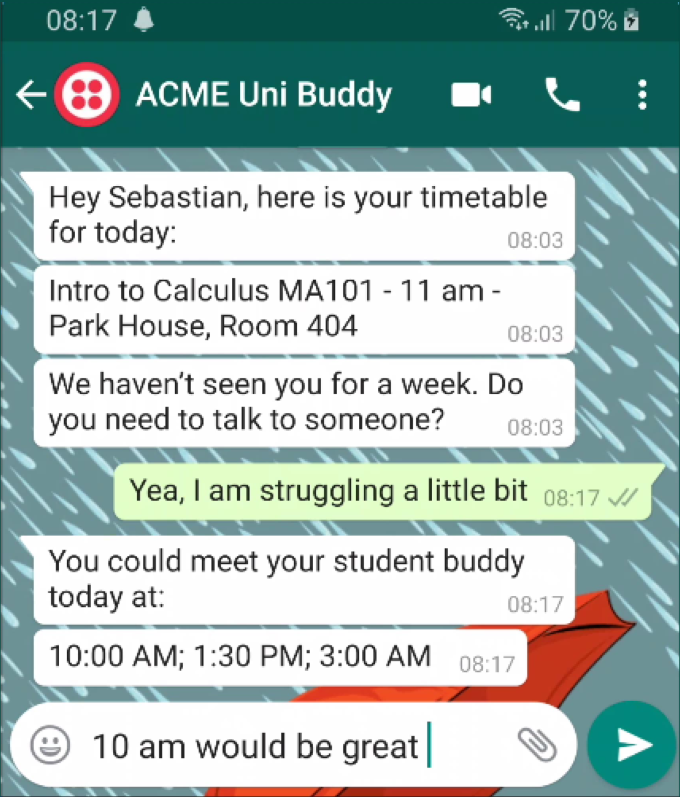
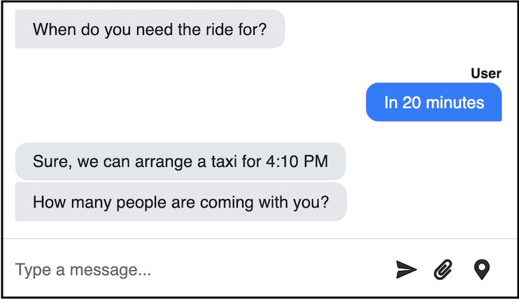

# NativeChat Whitepaper: The Era of Mobile Chatbots

### Intro

Messaging apps have become such an integral part of our lives, that you will probably forward this article via a text message instead of telling your friends about it.

We often find it easier to text one another than pick up a phone and talk. Someone calling you unexpectedly feels more intrusive with the sudden demand for our full attention often interrupting our current activity, while a text message gives us a choice to decide when to read and replay to it.

What is even more interesting, the modern etiquette dictates that you text the other person first before you start a call — that is even if the call has been arranged upfront.

**Text messaging in Numbers**

> We are in the **Text Messaging Golden Era**.

There are over 2.5 billion people that use messaging apps on mobile, and that number is predicted to reach 3 billion in 2022. ([Statista](https://www.statista.com/statistics/483255/number-of-mobile-messaging-users-worldwide/))
WhatsApp has 1.6 billion MAU (monthly active users). However, WhatsApp is not alone in this space with Facebook Messenger attracting 1.3 billion MAU and Viber with 260 million MAU. ([Statista](https://www.statista.com/statistics/258749/most-popular-global-mobile-messenger-apps/))

To paint a full picture, we should also include non-smartphones — as not everyone can afford a smartphone — and we are looking at 5 billion mobile phones capable of sending and receiving SMS messages, with the number of devices expected to grow to 5.9 billion by 2025. ([SlickText](https://www.slicktext.com/blog/2018/11/44-mind-blowing-sms-marketing-and-texting-statistics/))

In 2018, the "total worldwide text count" (for Messaging apps and SMS) was estimated at around 145 billion per day. ([TextRequest](https://www.textrequest.com/blog/how-many-texts-people-send-per-day/))

---

> ––––––––––––––––––––––––––––– TODO: turn into an infographic –––––––––––––––––––––––––––––
>
> **WhatsApp** in numbers:
> 2 billion users
> 1600 million monthly active users
> 65+ billion messages per day (2018)
>
> **Facebook Messenger** in numbers:
> 2.5 billion users
> 1300 million active users
> 1 billion messages per day
>
> **Viber** in numbers:
> 1 billion users
> 260 million active users
> 7 million interactions happen every minute on Viber => 10 billion interactions per day

---

---

> --- to remove?? ---
> **SMS** in numbers
> 5 billion users
> 8 trillion messages sent per day => 15.2 million messages per minute

---

**Cue: Enter Chatbots**

With the new communication behaviours come new expectations.
The communication via text messaging apps is not limited to casual conversations with friends and family, but we also expect to text with businesses we use — be it to order a taxi, get an update on the parcel we are waiting for, or ask 101 questions about the services/products on offer.

Majority of the requests and queries will repeat over and over again. Where your customer communication team will probably have a ready copy-and-paste set of answers. This is where a well designed AI Chatbot can really shine.

Businesses could use their knowledge of frequently asked questions to train a Chatbot equipped with Natural Language Processing (NLP) — to identify a relevant pre-trained Q&A and provide the user with a helpful answer.

Taking it further, the Chatbot could be trained to handle more complex Goal-Driven conversations and guide their users step by step — by asking for required details and providing helpful prompts and suggestions — to complete the task at hand.

### Do you may need a mobile chatbot?

How do you know if you need a mobile chatbot?
To answer this quesion, we need to break it down into two smaller questions:

1. Why a **chatbot**?
2. Why a **mobile** communication?

#### Why a chatbot? — Chatbot Benefits

To answer the first question, we should look at the benefits that a chatbot can bring.

[**TODO: might be good to have a graphic for this**]

- Chatbots can work 24/7 — regardless of the time of the day, your customers will always be provided with a level of support
- Chatbots can talk to many people at the same time — your users don't need to wait in a queue to have their queries addressed
- Chatbots are great at handling repetitive tasks — you can free your user-facing team from handling the tedious requests, and instead, they can handle more exciting requests
- Chatbots can integrate with your 3rd party systems — chatbots can provide quick and accurate responses, which are based on the real-time data
- Chatbots respond with relevant answers — your users don't need to search accross your website to find the information they are after. A chatbot can give them the exact info they need, nothing more, nothing less

In summary, if you need to scale and handle a constant stream of questions and requests from the users, then you should seriously consider introducing a chatbot to your business.

Moreover, if you are looking for a way to automate a big portion of the repetitive questions, and also to handle well established/standarised tasks, which require communicating with your backend — and thus allowing your staff to focus on more demanding tasks — then again, a well designed chatbot would be a smart move.

#### Why a mobile communication?

There are many reasons why your business should open a mobile communication channel.

**Become a contact**

Like we established at the beginning of this whitepaper, billions of people communicate with each other and with businesses using their mobile devices. Making mobile devices a natural place for people to communicate with you and your business.

What is particularly interesting that if you give access to your customers to communicate with you via WhatsApp (or any other mobile platform), you suddenly become one of the contacts in their address book. One that is a lot easier to reach out to, ask the right questions, and buy a product/service from.

**They already have the app?**

One way to reach your customers on a mobile device could be with a Native Mobile app. However, (a) it takes time and money to build one, and (b) it requires your users to download your app. While everyone with a mobile phone can be reached via SMS, and most smartphone users will have at least one of WhatsApp/Viber/Facebook Messenger.

For example, if you travel accross the Balkans, most of taxi companies there, advertise that they can be reached on a number via WhatsApp or Viber. Unlike Über, they are not asking anyone to download any apps, just to send them a text message. While, also you don't need to worry about roaming charges — that is if you can find a working WiFi.

Or you could have a shop assistant chatbot that would guide the users on their shopping jourey: it could provide detailed information about a product, check the stock and show them in which isle to find it. Additionally, if the customer asks question that would go out of chatbot's depth, the chatbot could offer to call a member of staff to customer's location to provide them with more advanced help.

And there are many more examples, where you could open up an easy channel for your customers to reach you without the hassle of installing a native mobile app.

**Initiate a conversation – Nudge**

One unique feature that comes with mobile based communication is that you can initiate the conversation with your contacts.

I don't mean here that you should spam your contacts with adverts, but rather use this channel to send them an update on things that are relevant to them, or nudge them to initiate an importnat process.

For example, an airline chatbot could send a notifications that the online check-in is open, and offer to start the check-in via a chatbot conversation, or a university chatbot could ping a student that missed too many classes with the info on the next class, and offer to talk to someone if needed.



#### 2 + 2 = Mobile Chatbot

If you add these two questions, and your two answers say that your organisation needs both a chatbot and a mobile communication channel, then we can safely say that you should invest in building a mobile chatbot.

### NativeChat

Progress® NativeChat is an innovative artificial intelligence-driven platform for creating and deploying purpose-built chatbots. A NativeChat bot takes pressure off human teams by handling the repetitive and routine, leaving your staff free for interactions that delight and retain customers.

**Natural Language Processing**

NativeChat employs **Natural Language Processing** (NLP) — the ability of a computer program to understand human language as it is spoken — to analyse the things that the users say and respond with an appropriate answer.

With the use of NLP, we can train our chatbot on how to respond to various things that the users say. In some cases the user might be asking a simple question, the chatbot could recognise the question and provide an answer, in other cases the user might be asking for something more complex, and the chatbot could trigger a step-by-step conversation to help them with their request.
For example, when a customer wants to order a taxi, they should be able to use any expressions like: "I want to order a taxi", "Book a ride", "Pick me up", and the chatbot should start the **Order Taxi Conversation**.


Moreover, a well functioning chatbot should be able to understand dates and time in the way that people speak. For example, a customer ordering a taxi — when asked to provide the date and time of the pick up — should be able to say that they need a ride: "Today at 6pm", "On Friday at noon", or even "In 20 minutes", in each case the chatbot should translate these requests to a  Date and a Time values.




**Languages**

NativeChat can handle 60+ different languages. This allows you to offer a chatbot conversation in the language that your user feels most comfortable with.


According to Forbes, 60% of consumers do not (or rarely) buy from English-only sites. Multilingual support can greatly increase the adoption of bots especially within regions where multiple languages are spoken. If targeting a global audience, leveraging a chatbot that supports the ten most common languages will open up conversations to more than three billion people worldwide.

**Declarative Programming**

NativeChat uses **declarative programming** to create conversation flows, which replaces the traditional if-else programming approach.

> Declarative chatbots lower the entry bar for Chatbot creators

Declarative programming allows developers to focus on the goals and the information that the chatbot needs to capture from the user, without having to code the exact behaviour of the chatbot or the designing the User Interface.

For example, it takes only a few lines of code to instruct the chatbot how to aks the user for their email address — `messages` is where we specify the message prompt.

```json
{
  "type": "question",
  "entity": "email",
  "entity-type": "Email",
  "messages": [
    "What is your email address?"
  ]
},
```

Additionally, if we train our chatbot to understand what product names we have (i.e. Fiddler, Kendo UI, NativeChat, and Sitefinity) and label them as a **Product** entity type. We could easily add another step to our conversation, asking for the product the user might be interested in, and by adding a **display** of type **quick-reply**, we instruct the chatbot to display the available options as a set of buttons.

```json
{
  "type": "question",
  "entity": "product",
  "entity-type": "Product",
  "messages": [
    "Which product are you interested in?"
  ],
  "display": {
    "type": "quick-reply"
  }
}
```

With the above two code snippets, we get a chatbot that can handle a conversation like this.


**Deployment**

A NativeChat chatbot can be deployed to many different platforms, like:

[**TODO: convert these to logos**]

- your website
- WhatsApp
- Viber
- SMS
- Facebook Messenger
- Amazon Alexa

> Each of the deployment platforms come with their own advantages and limitations.
> For example, you can speak to an Amazon Alexa Skill, and it will talk back to you, which feels natural and very inviting. However, voice-based chatbots might struggle to list multiple available options – as it would take a long time for it to say all of them – or they are not great at spelling things like car registration plates.

You could deploy the same chatbot to multiple platforms. With one project, you could deploy your chatbot to WhatsApp, SMS and Viber and let your customers hail a taxi with the platform they feel most comfortable with.


[**TODO: The above images should be all in one row next to each other**]
[**Captions/titles for above images 	WhatsApp		SMS		Viber**]

### Types of conversations

NativeChat can be trained to handle various types of conversations, each fulfils different tasks and provides a different experience. Depending on your business needs you might need to utilise one conversation type more than others, however, most successful chatbots use a mixture of all conversation types.

**Question Answering** vs **Guided Task**

The simples distinction between types of conversations is whether the chatbot can respond with a straight answer or whether it needs to engage in a longer conversation.

**Question Answering** conversation – the chatbot identifies the question and responds with the corresponding answer.

Question Answering conversations are great at providing your users with a one-stop-shop for all their enquiries.
Moreover, you can continuously update the set of Questions and Answers handled by your chatbot.

For example, a university chatbot could be trained to inform prospective students about walking tours.


**Guided Task** conversation – the chatbot leads the user on a step-by-step journey, asking the required questions, and providing the available options along the way.

Guided Task conversations are used for situations where we need more information in order to perform a task or provide an answer.

For example, a university chatbot might need to ask a new student for their name, degree and email to register them on the system.


**Static** vs **Dynamic**

We can also look at conversations from the perspective of whether the chatbot needs to query the backend to provide an answer or not.

**Static** conversations – chatbot is trained with fixed answers/values and it doesn't need to consult any additional systems to respond to the user.

For example, when a student asks about the exam dates, the dates are fixed and the chatbot can provide the pre-trained answer.


**Dynamic** conversations – chatbots are instructed to identify request parameters and query the backend for the answer.

For example, when a student asks about the exam for "Intro to Calculus", the chatbot identifies the "Intro to Calculus" as the subject, checks the backend for the next exam date/time and responds with a dynamically generated answer.


**Generic** (Linear) vs **Personalized** (Contextual)

In other cases, a chatbot might provide different answer depending or irrespective of the person that it is talking to.

**Generic** (Linear) conversations – chatbot provides the same information irrespective of whom it is talking to.

For example, when a person asks about the location of a building, the chatbot doesn't need to know who the user is, it can go straight to answering the question.


**Personalized** (Contextual) conversations – chatbots are aware of the user that it is talking to, and provides answers that are tailored specifically to the user. Often Personalized conversations require the user to log in.

For example, when a student asks about their next class, the chatbot needs to query the backend — using the user as the key — and respond with the relevant answer.


**Proactive** vs **Reactive**

Finally, we should look at conversations in terms of who initiates the conversation.

**Proactive** conversations – chatbots initiate the conversations with the user, prompting them to provide some additional information, or nudging them towards a designated behaviour.

Proactive conversations can only be delivered over SMS/WhatsApp chatbots, as the chatbot needs a way to notify the user of the upcoming message.

For example, the chatbot could integrate with the Assignment System at a university. The Assignment System could use the chatbot to send a reminder to each student about the upcoming assignment and provide suggestions on how to submit the assignment. Thus, informing the student about the way they can submit the assignment and encouraging them to submit the assignment on time.


**Reactive** conversations – chatbots respond to each request coming from the users. Most of the chatbot conversations are reactive.

For example, when the student wants to submit an assignment, the chatbot reacts to that and guides them through the process.


### Chatbots are not here to replace People

It is important to understand that chatbots are most effective when used as a support to a well-functioning user-facing team, not as their replacement. There are many reasons why chatbots will never be a good idea as a replacement for people.

**10/90**

You would spend 10% of the time to train a chatbot to handle 90% per cent of commonly asked questions, but you would spend 90% of the time to handle the remaining 10% of the edge cases. This would make it too time-consuming to be worthwhile.

A formula of a chatbot — that can handle a bulk of the questions — plus a team of people — capable of handling the rest — make it for the most effective cost-effective solution.

**No "Improv"**

From time to time, you will get a customer with a special set of questions/requirements, which a pre-trained chatbot would fail to respond to alone, as chatbots are not great at thinking on their errr.... well they can't improvise.

While people are great at adapting to unique situations, and a person is a lot more likely to improvise and find a good way to handle the situation.

This is where a chatbot with functionality to switch to **Live Chat** — the ability to transfer the conversation to a human agent — would provide the optimal support to all customers.

**People train chatbots**

To build a great chatbot capable of handling many scenarios, we need **the knowledge of people** that answer the customer questions/requests on a day to day basis.

If you were to attempt to completely replace your user-facing team with a chatbot, your team wouldn't have any incentive in training their replacement. As a result of which, you would get the worst of the two worlds: a demotivated team and a poorly trained chatbot.

You should treat the chatbot as a way to make your customer-facing team more efficient, and transform the people from a team of script-reading "parrots" to a team of highly respected Subject Matter Experts.

### CTA


INSERT BOILERPLATE TELERIK/PROGRESS ABOUT/COPYRIGHT INFO ETC

